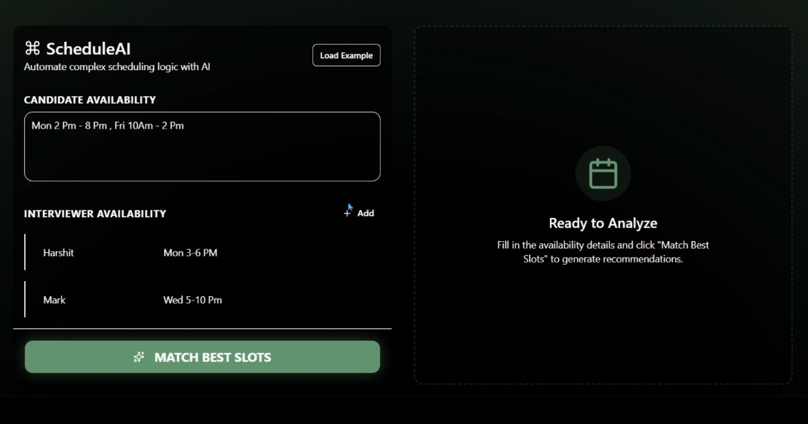

# 🗓️ ScheduleAI

**The Future of Remote Hiring & Conflict Resolution.**

ScheduleAI is a premium, AI-powered interview scheduling platform designed to eliminate the manual hassle of finding common free time between candidates and interviewers. Developed for **Nutrabay**, it leverages state-of-the-art LLMs to resolve complex scheduling conflicts in milliseconds.



## Features

- **AI-Powered Matching**: Utilizes Groq's Llama 3.3 model to logically intersect schedules and resolve conflicts instantly.
- **Messy Text Support**: No more rigid date pickers. Paste free-text availability like *"M-W 2-5pm"* or *"Friday morning before noon"*.
- **Conflict Analysis**: Provides a detailed breakdown of why certain slots were skipped or prioritized.
- **Premium UI/UX**: Built with a sleek dark-themed interface, featuring:
  - **Glassmorphism** & Aurora background effects.
  - **Framer Motion** for smooth, micro-animations.
  - **Responsive Design** for all devices.
- **Smart Recommendations**: Generates the top 3 optimal slots with a final recommendation ready to be copied into an invite email.

## Tech Stack

- **Framework**: [Next.js](https://nextjs.org/) 
- **Styling**: [Tailwind CSS](https://tailwindcss.com/) + [shadcn/ui](https://ui.shadcn.com/)
- **Animations**: [Framer Motion](https://www.framer.com/motion/)
- **Content**: React Markdown + Remark GFM

## Getting Started

### Prerequisites

- Node.js 18+ 
- A Groq API Key (Set in `.env.local`)

### Installation

1. **Clone the repository**
   ```bash
   git clone https://github.com/your-username/nutrabayai.git
   cd nutrabayai
   ```

2. **Install dependencies**
   ```bash
   npm install
   ```

3. **Configure Environment Variables**
   Create a `.env.local` file in the root directory:
   ```env
   API_KEY=your_api_key_here
   ```

4. **Run the development server**
   ```bash
   npm run dev
   ```

5. **Open the app**
   Navigate to [http://localhost:3000](http://localhost:3000) to see the magic.

## How It Works

1. **Define Availability**: Enter the candidate's window and add as many interviewers as needed.
2. **Analyze**: Click "Match Best Slots". The AI will return the top options along with a detailed reasoning markdown.
3. **Copy & Send**: Use the copy button to grab the final recommendation for your invite email.


*Optimized for Nutrabay's Productivity.*